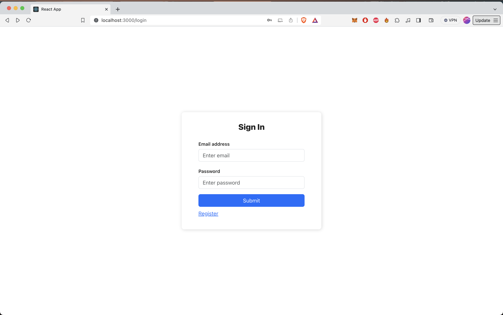
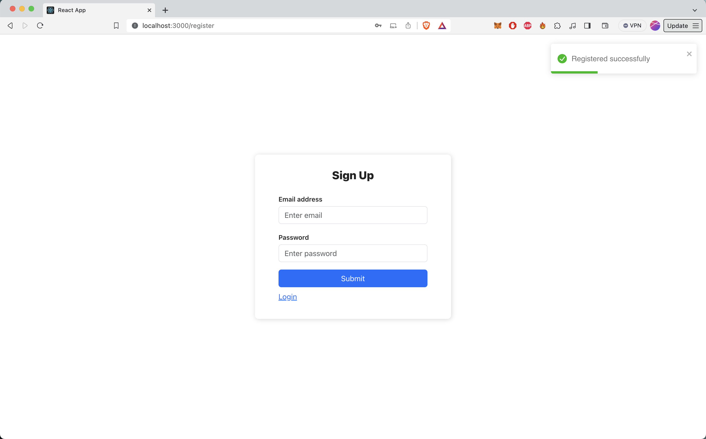
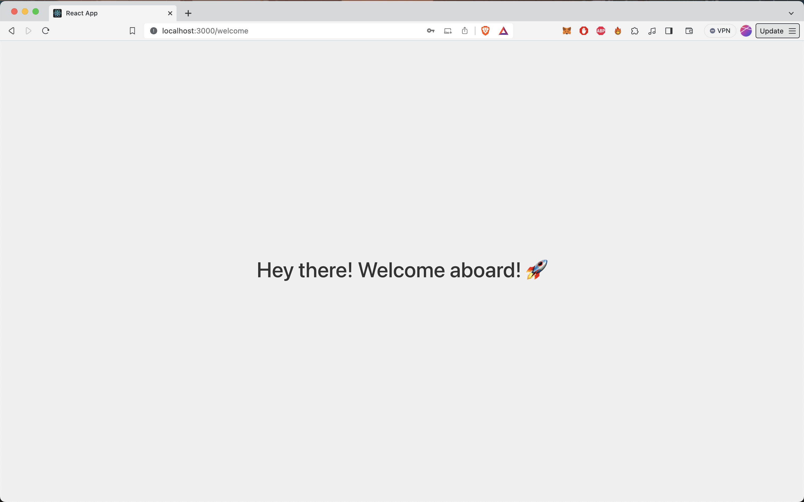

# React Learning Project

## Overview

This project was undertaken as part of my learning journey in React. It's a simple web application that demonstrates basic React functionalities including routing, state management, and interaction with a backend server. The application includes four main pages:

- **Homepage:** The starting point of the application.
- **Login Page:** Allows users to log in.
- **Register Page:** Enables new users to register.
- **Welcome Page:** A welcome screen that users see after successfully logging in.

The application is designed to work with a local backend server running on `localhost:3000`.

## Getting Started

To get the project up and running on your local machine, follow these steps:

### Prerequisites

- Node.js
- npm (usually comes with Node.js)

## Installation

Follow these steps to get the project running on your local machine:

1. **Clone the repository**
   ````
      git clone https://github.com/upretisaurav/OptiOrganizer.git

2. **Navigate to the project directory**
    ```
        cd react-frontend
    ```
3. **Install NPM Packages**
    ```
        npm install
    ```
4. **Start the development server**
    ```
        npm start
    ```

## Screenshots

Here are some screenshots of the application:

### Homepage


### Login Page


### Register Page


### Welcome Page

